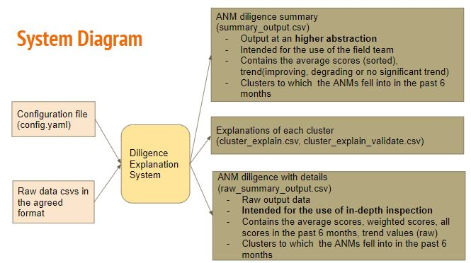

# Healthworker Diligence Measurement and Explanation System

The poor quality of health data collected in low resource communities is a big hindrance for application of machine learning techniques in improving general health. 
Here, we define a data collection quality score for each health worker who collects data. 
This challenging unlabeled data problem is handled by building upon human guidance to design a useful data representation that is then clustered to infer data quality labels or a score. 
This score already provides for a measurement of data collection quality; in addition we also predict the quality for future time steps.
We also provide an explanation of each cluster's behavior using a sparse hyperplane tree..

## System Diagram

### Documentation

Please find the main documentation [here](./docs/Full_Documentation.pdf)